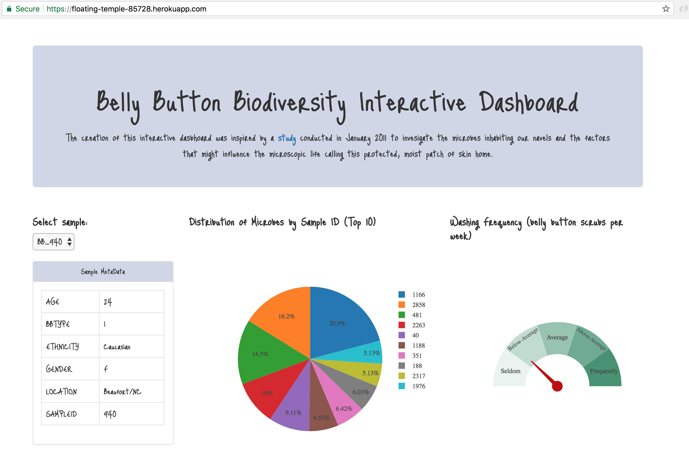
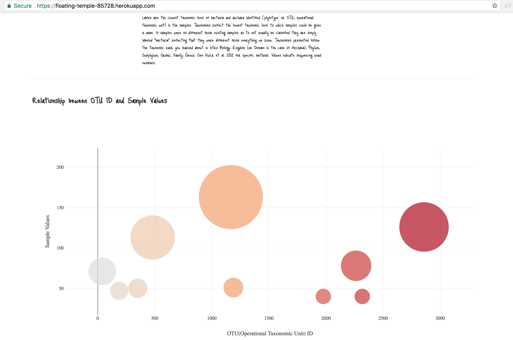

## Belly Button Biodiversity Interactive Dashboard 
##### Full-Stack Data Analytics Web Application

The creation of this interactive dashboard was inspired by a [study](http://robdunnlab.com/projects/belly-button-biodiversity/) conducted in January 2011 to invesigate the microbes inhabiting our navels and the factors that might influence the microscopic life calling this protected, moist patch of skin home.
 
The application is deployed on Heroku at the following link https://floating-temple-85728.herokuapp.com/.

#### Key features
* Interactive dashboard based on Plotly.js

#### Technology stack used:

* Sqlite
* Pandas
* Flask microframework
* SQLAlchemy(Python SQL toolkit and Object Relational Mapper)
* Javascript
* Plotly.js(Visualization)
* HTML/CSS/Bootstrap
* Heroku

#### User Interface

